# Formula 1 Azure Databricks Pipeline

Este proyecto implementa una solución completa de Lakehouse sobre **Azure Databricks** para el procesamiento, transformación y análisis de más de 70 años de datos del campeonato de Formula 1 (1950 – Actualidad).

El sistema pasa de ingestar datos crudos en formatos heterogéneos (CSV y JSON anidados) a construir una capa analítica optimizada mediante la **Arquitectura Medallion** (Bronze, Silver, Gold) mediante el uso de **Apache Spark**. El almacenamiento de los datos se realiza en **Azure (ADLS Gen2)** (mediante una capa *landing* que contiene el dato en crudo y el uso de **Delta Tables**) y la orquestación del flujo de trabajo se gestiona mediante **Lakeflow Jobs**. Ofrece una infraestructura escalable con soporte para cargas incrementales, control de esquemas, linaje de datos mediante Unity Catalog y gestión de entorno simplificada.

--- 

## Arquitectura

### 1. Diagrama End-to-End (Medallion)

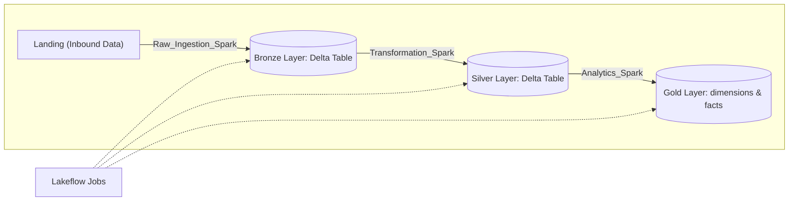
---

##### Capa Bronce

---

##### Capa Silver
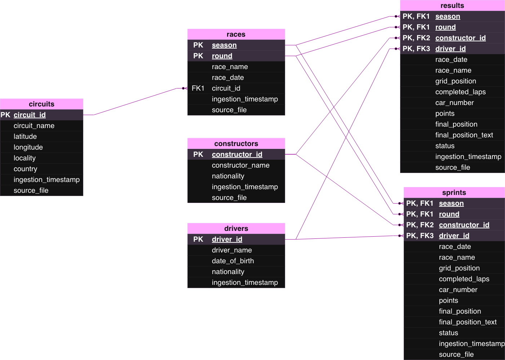

---

##### Capa Bronce
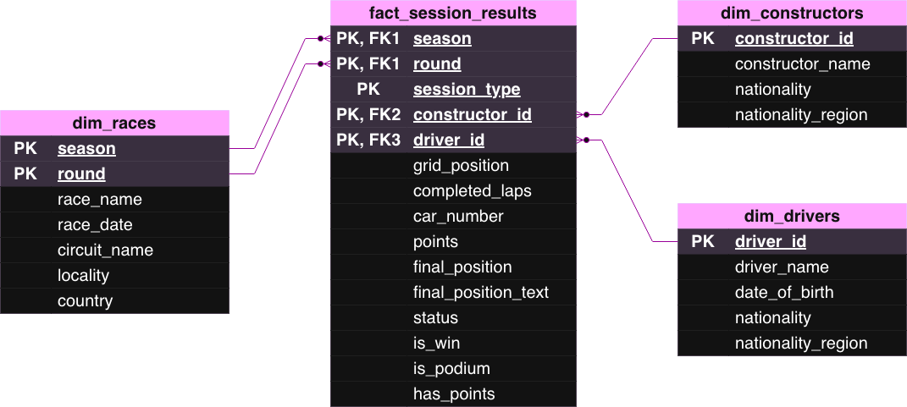

---

### 2. Diagrama Carga Incremental

La carga incremental se realiza en base a una tabla de control (*batch_control*) y 4 procesos secuenciales:

- **1. Identify Next Batch**: Analiza si existen nuevos datos en la carpeta de *Landing*.
- **2. Create New Batch**: En caso afirmativo, crea un nuevo registro en la tabla de control.
- **3. Process Batch**: Llama al pipeline completo para procesar el nuevo batch.
- **4. Mark Batch Complete**: Marca el registro como completado en la tabla de control.

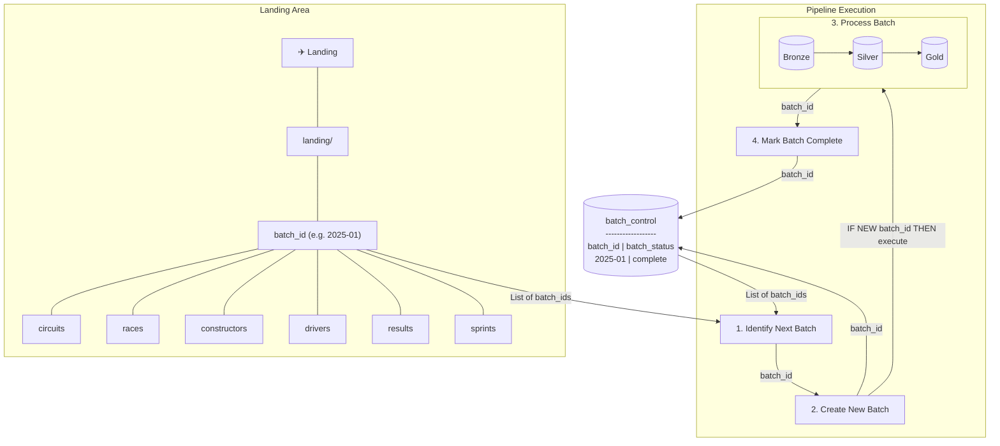
---

## Resultados obtenidos

### 1. Almacenamiento

### - Landing (Azure)

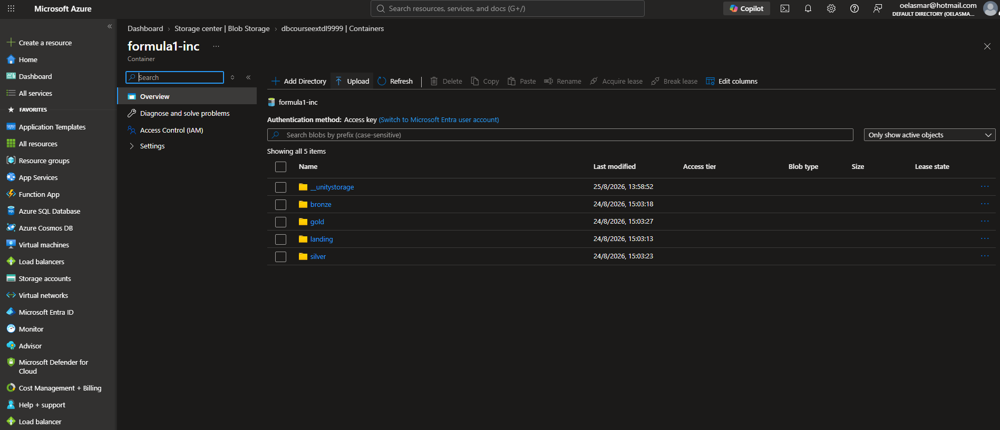

### - Landing (Databricks)

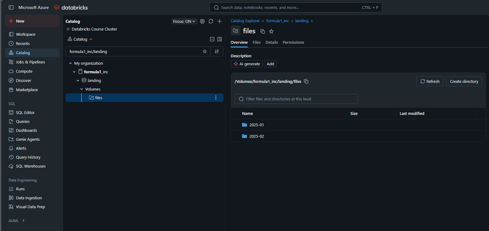

### - Capa Bronce

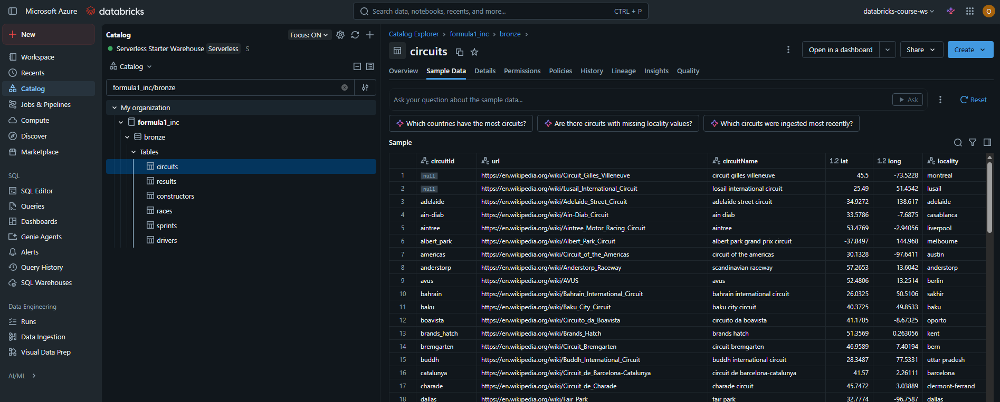

### - Capa Silver

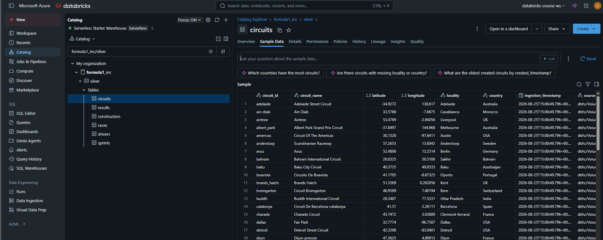

### - Capa Gold

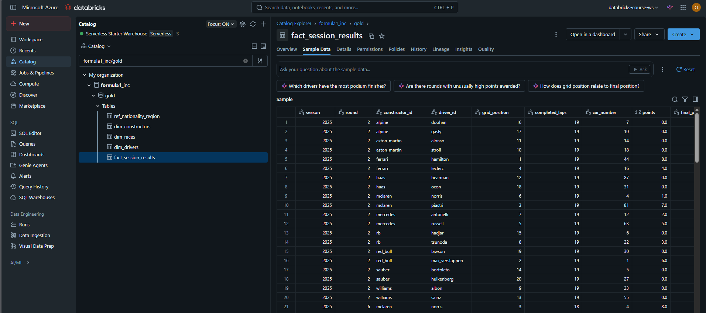

### 2. Notebooks

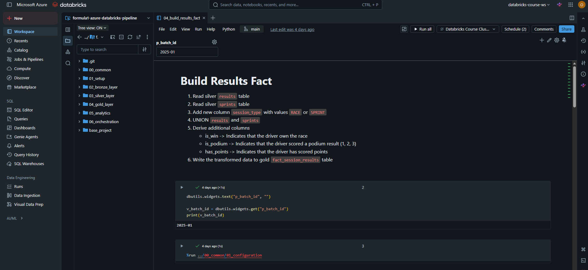

### 3. Orquestación

### - Esquema

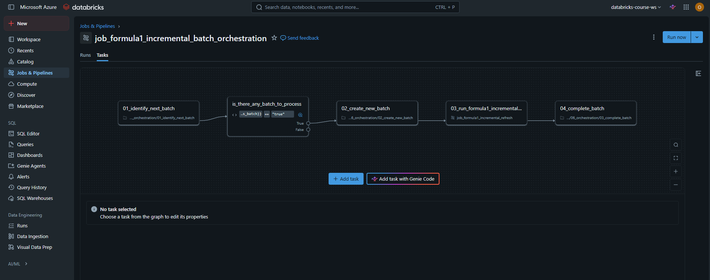

### - Ejecución

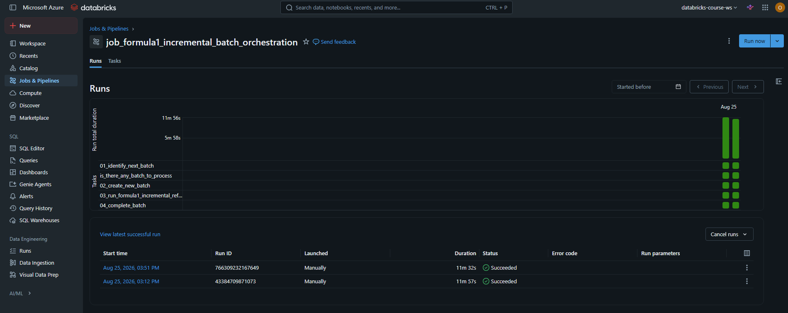

### 4. Dashboards

### - Driver Standings

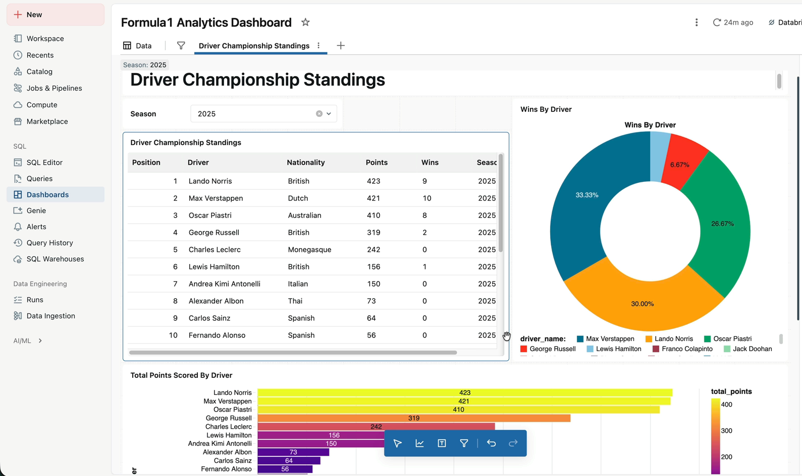

### - Dominant Drivers

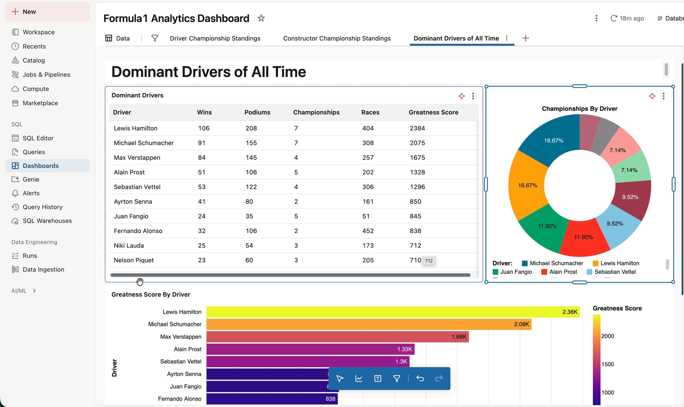

---

## Tech Stack

| Área | Tecnologías Utilizadas |
| :--- | :--- |
| **Compute Engine** | Azure Databricks (PySpark, Spark SQL) |
| **Storage & Lakehouse Layer** | Delta Lake (Bronze ➔ Silver ➔ Gold), ADLS Gen2 |
| **Data Governance** | Databricks Unity Catalog |
| **Orchestration** | Databricks Jobs |
| **Data Analytics & BI** | Databricks Dashboards (AI/BI Dashboards) |
| **Version Control** | Git / GitHub |

---

## Justificación del Stack

Este proyecto ha sido construido con un enfoque puramente práctico para consolidar y validar mis competencias en el ecosistema completo de **Azure** y **Databricks**, trabajando las diferentes herramientas disponibles:

- *Azure Databricks*.
- *Notebooks*.
- *Apache Spark*.
- *Delta Lake + ADLS Gen2*.
- *Unity Catalog*.
- *Lakeflow Jobs*.
- *Databricks Dashboards (AI/BI)*.
- *Genie AI*.

---

## Características principales
- **Aplanado de JSONs Complejos**: Descomposición dinámica de estructuras anidadas.
 
- **Uso de Cargas Incrementales (MERGE)**: Actualización eficiente de registros modificados o nuevos sin reescribir tablas completas.
 
- **Gestión de Secretos**: Uso de Azure Key Vault y Databricks Secret Scopes para almacenamiento seguro de credenciales.
 
- **Calidad de Datos**: Validación de esquemas y tipos de datos en la capa Silver previo al cálculo de agregaciones en Gold.

